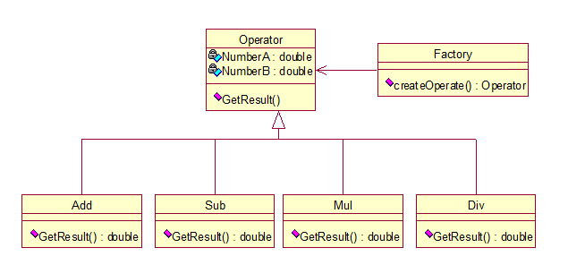
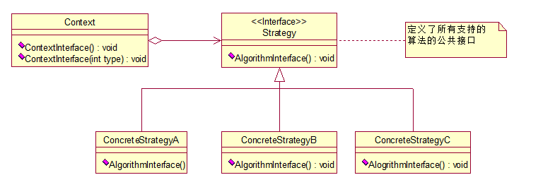
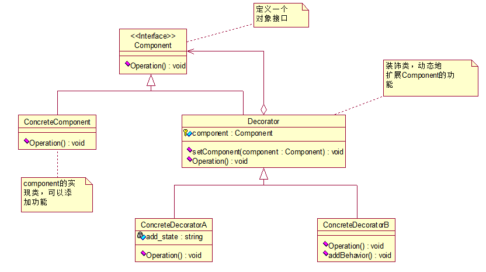

# DesignPattern

# 设计模式

阅读书目《大话设计模式》
记录23种设计模式的实现代码，使用C++语言，vs2017

博文：[模式设计学习笔记](https://chengchengzi.github.io/2019/06/07/模式设计学习笔记/)

## 一、[简单工厂模式](SimpleFactory)

- **解决了对象创建问题**
- 包含三个角色：工厂类、抽象父类、具体子类
- 优点：实现了松耦合
- 当需要增加新的功能时，只需要改动两处，不会对原来已经实现的功能进行改动；
	- 新增具体功能子类
	- 工厂类增加switch分支
- 类图如下：
	

## 二、[策略模式](Strategy)
- 面向对象编程，并不是类越多越好，类的划分是为了封装，但分类的基础是抽象，具有相同属性和功能的对象的抽象集合才是类；
- 策略模式适用算法经常变动的情况；
- 策略模式将让算法或策略独立于使用策略的用户；
- 策略模式与工厂对比：
	- 从类图可以看出，二者在模式结构上很相似
	- 用途不一样：工厂的主要作用在于创建对象，策略的主要作用让一个对象在多种行为中选择一种行为
	- 关注点不一样：工厂关注对象的创建，策略关注行为的封装和策略的切换扩展；
- 类图：
	

## 三、装饰模式
- 定义：装饰模式动态扩展类的功能，是为已有功能动态地添加更多功能地一种方式；
- 优点：装饰类和被装饰类可以独立发展，不会相互耦合；
- 类图：
	
